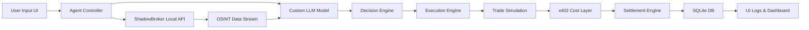
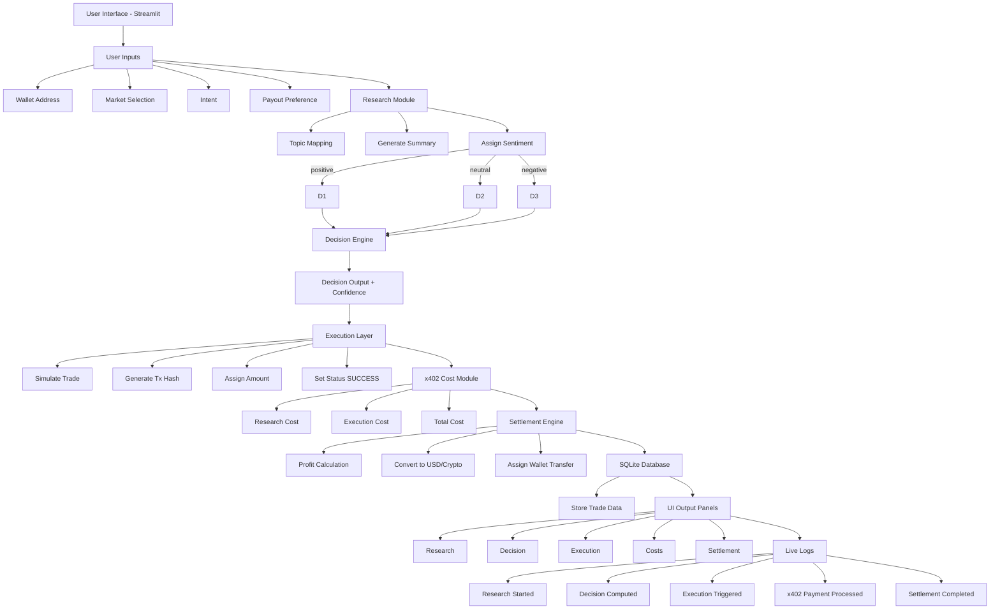
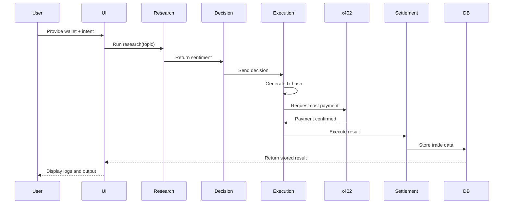

# ElsaFlow

## Index

* Overview
* Workflow
* Demo
* Trade Mechanism
* Features
* Data Source and Real-Time Intelligence
* Trading Strategy and Capital Model
* Core Algorithm and Decision Strategy
* Polymarket Track Alignment
* Target Domains and Use Cases
* Economic Model and Agent Monetization
* Autonomous Trading Model and Capital Safety Logic
* LLM + OSINT Agent Flow
* How It Works
* System Architecture
* Execution Sequence
* Project Structure
* Setup and Run
* Database
* Alignment with Elsa and x402
* Notes

---

ElsaFlow is an autonomous research-to-execution trading agent designed to demonstrate the execution model of agentic systems aligned with Elsa and x402.

The system is implemented as a single Python script that automatically sets up its environment, installs dependencies, and launches a full Streamlit-based interface. It simulates a complete pipeline from research to execution, including cost handling and settlement.

---

## Overview

ElsaFlow showcases how an autonomous agent can operate end-to-end without manual intervention:

* Accept user intent and wallet input
* Perform structured research
* Derive sentiment and make decisions
* Execute trades in a simulated testnet environment
* Apply x402-style monetization
* Settle results and persist data

---

## Workflow


---

## Demo

Loom Video:
https://www.loom.com/share/ad1290f386534856a2a21af546db9c37

---

## Trade Mechanism


---

## Features

### Autonomous Agent Pipeline

* Research → Decision → Execution → Settlement

### Research Module

* Perplexity-style structured output

### Decision Engine

* Positive → YES
* Negative → NO
* Neutral → SKIP

### Execution Layer

* Simulated testnet trades

### x402 Monetization Simulation

* Cost tracking

### Settlement Engine

* Profit/loss simulation

### Persistence

* SQLite database

### User Interface

* Minimal Streamlit UI acting as control layer

---

## Data Source and Real-Time Intelligence

ElsaFlow is designed to operate on OSINT-based real-world data.

The backend integrates with systems like **ShadowBroker (OSS data aggregator)**:

* Real-time data ingestion
* Event-driven signals
* Continuous analysis

This enables dynamic decision-making instead of static logic.

---

## Trading Strategy and Capital Model

* User sets **initial capital**
* Agent trades until:

  * Capital + profit threshold (e.g., 50%) reached

### Break-even Logic

* Initial capital is returned
* System enters **profit-only mode**

---

## Core Algorithm and Decision Strategy

1. OSINT Data Ingestion
2. Sentiment Analysis
3. Decision Mapping
4. Confidence Scoring
5. Trade Execution
6. Continuous learning loop

---

## Polymarket Track Alignment

Built for:

Track 2 — Polymarket Agent

* Converts signals → trades
* Simulates execution
* Provides explainable outputs

---

## Target Domains and Use Cases

* Crypto
* Finance
* Prediction markets
* Elections
* AI / IoT trends

---

## Economic Model and Agent Monetization

* Agents pay for:

  * Research
  * Execution

* x402 enables:

  * Autonomous cost handling
  * Continuous economic activity

---

## Autonomous Trading Model and Capital Safety Logic

### Minimal Interface

User only:

* Selects category (mapped to ShadowBroker data)
* Defines intent
* Sets capital

---

### Capital Safety Flow

1. Initial Trading Phase
2. Recovery Phase
3. Safe Rollback → Capital returned

---

### Profit Loop

* Agent trades using only profits
* 50% profit → returned to user
* Remaining → reinvested

---

### Risk Control

* Max loss: 40% of profits
* If triggered:

  * Agent halts trading
  * Switches to analysis mode
  * Requires user approval

---

### Transparency

* SQLite logs
* Full trade history
* Performance tracking

---

## LLM + OSINT Agent Flow



---

## ShadowBroker Integration 


```python
# Placeholder for ShadowBroker API integration

def fetch_osint_data(category):
    """
    Connect to local ShadowBroker instance
    Fetch relevant OSINT data for selected market
    """
    pass
```

---

## How It Works

1. User inputs wallet, intent, market
2. Agent fetches OSINT data
3. LLM processes signals
4. Decision engine selects trade
5. Execution simulated
6. Cost applied (x402)
7. Settlement computed
8. Stored in DB
9. Displayed in UI

## System Architecture



---

## Execution Sequence



---

## Project Structure

This project is intentionally implemented as a single-file system:

* Python script handles setup and runtime
* Virtual environment is created automatically
* Dependencies are installed dynamically
* Streamlit app is embedded in the same file

---

## Setup and Run

### Requirements

* Python 3.8+

### Run the application

```bash
python your_script_name.py
```

The script will:

* Create a virtual environment
* Install dependencies
* Launch the Streamlit interface

---

## Access the Application

Open in browser:

http://localhost:8501

---

## Database

* SQLite database file: trades.db
* Automatically created on first run
* Stores all trade executions and metadata

---

## Alignment with Elsa and x402

ElsaFlow demonstrates:

* Intent-based agent design
* Autonomous execution pipeline
* Simulated agent-side cost handling (x402)
* Testnet-style execution abstraction
* Self-custodial user interaction

The system focuses on architecture and execution flow rather than real on-chain integration, ensuring stability and reproducibility.

---

## Notes

* No external APIs required
* Fully deterministic behavior
* Designed for hackathon demonstration
* Optimized for fast setup and execution

---

## License

MIT License
