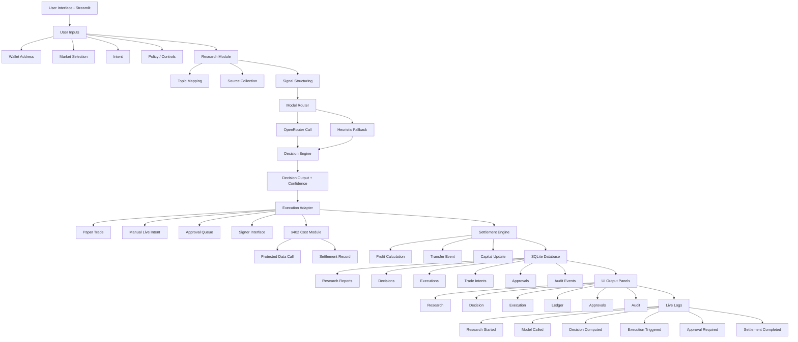
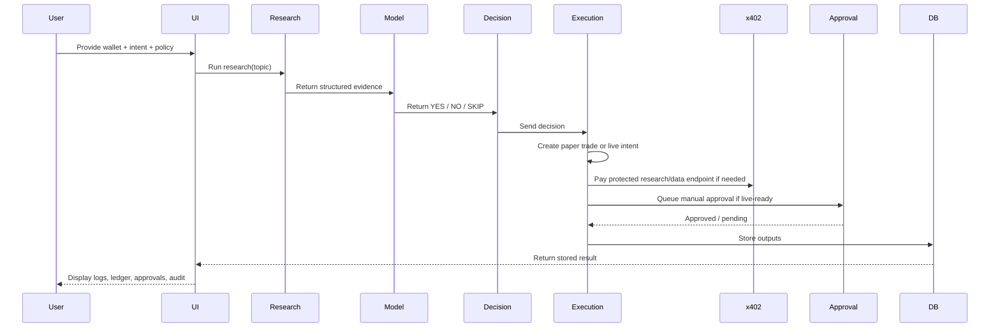

---

## Index

* [Overview](#overview)
* [Workflow](#workflow)
* [Demo](#demo)
* [Trade Mechanism](#trade-mechanism)
* [Features](#features)
* [Data Source and Real-Time Intelligence](#data-source-and-real-time-intelligence)
* [Trading Strategy and Capital Model](#trading-strategy-and-capital-model)
* [Core Algorithm and Decision Strategy](#core-algorithm-and-decision-strategy)
* [Polymarket Track Alignment](#polymarket-track-alignment)
* [Target Domains and Use Cases](#target-domains-and-use-cases)
* [Economic Model and Agent Monetization](#economic-model-and-agent-monetization)
* [Autonomous Trading Model and Capital Safety Logic](#autonomous-trading-model-and-capital-safety-logic)
* [LLM + OSINT Agent Flow](#llm--osint-agent-flow)
* [ShadowBroker Integration](#shadowbroker-integration)
* [How It Works](#how-it-works)
* [System Architecture](#system-architecture)
* [Execution Sequence](#execution-sequence)
* [Project Structure](#project-structure)
* [Setup and Run](#setup-and-run)
* [Access the Application](#access-the-application)
* [Database](#database)
* [Alignment with Elsa and x402](#alignment-with-elsa-and-x402)
* [Validation and Backtesting](#validation-and-backtesting)
* [Safety and Current Scope](#safety-and-current-scope)
* [Notes](#notes)
* [License](#license)
---

ElsaFlow is an autonomous research-to-execution trading agent designed to demonstrate the execution model of agentic systems aligned with Elsa and x402.

The original hackathon build started as a single-script prototype. This repository now evolves that idea into a more realistic MVP control plane: modular Python services, Streamlit UI, OSINT adapters, model routing through OpenRouter, paper execution, manual live-intent approval, signer-backed wallet scaffolding, x402 paid-call testing, and audit/control layers.

---

## Overview

ElsaFlow showcases how an autonomous agent can operate end-to-end with a safer MVP posture:

* Accept user intent and wallet input
* Perform structured OSINT collection
* Route evidence through model analysis
* Derive decisions and confidence
* Execute paper trades or create live-ready trade intents
* Apply x402-style payment handling for protected research/data endpoints
* Settle results and persist data
* Expose logs, approvals, audit events, and transaction-style ledgers in the UI

---

## Workflow


The current implementation keeps the same research-to-execution spirit while adding:

* OpenRouter-based model calls with fallback heuristics
* ShadowBroker-aligned public OSINT feed adapters
* Paper/live-ready execution separation
* Manual approval queue for live intents
* Audit and control tracking

---

## Demo

Loom Video:
https://www.loom.com/share/ad1290f386534856a2a21af546db9c37

The Loom demo represents the original hackathon showcase. This repository now extends that concept toward an MVP implementation.

---

## Trade Mechanism


---

## Data Aggregator OSINT Based


---

## Features

### Autonomous Agent Pipeline

* Research → Decision → Execution / Intent → Settlement / Approval

### Research Module

* Structured evidence collection from ShadowBroker-compatible public OSINT sources
* Streamlit trace of sources, titles, URLs, and signal metadata

### Decision Engine

* Positive → `BUY_YES`
* Negative → `BUY_NO`
* Weak / mixed → `SKIP`

### Model Router

* OpenRouter integration for real model analysis
* Fallback heuristic when model call fails or rate limits
* Per-model request/response trace in the UI

### Execution Layer

* Paper-trade execution simulator
* Manual-live-ready intent generation
* Approval queue before any future live execution path

### x402 Monetization / Payment Layer

* Protected endpoint testing through an x402 wrapper
* Settlement record logging for paid research/data requests

### Signer Wallet Layer

* Dry-run signer
* Local key-reference signer scaffold
* Live-ready wallet interface without exposing raw signing logic in the UI

### Governance / Controls

* Manual approval queue
* Kill switch
* Max trade notional
* Max daily notional
* Audit event log

### Persistence

* SQLite database for sessions, research, decisions, executions, transfers, approvals, trade intents, x402 payments, and audit events

### User Interface

* Streamlit control plane
* Sticky status bar
* Terminal-style agent console
* Paper transaction ledger
* Backtest and replay validation panels

---

## Data Source and Real-Time Intelligence

ElsaFlow is designed to operate on OSINT-based real-world data.

The intended robust data backbone is **ShadowBroker (OSS data aggregator)**:

* Real-time data ingestion
* Event-driven signals
* Continuous analysis

This repository currently supports:

* ShadowBroker-compatible adapter path
* Public no-signup fallback sources aligned to the ShadowBroker style:
  * GDELT
  * USGS
  * CelesTrak
  * SatNOGS

Reference repo:
https://github.com/BigBodyCobain/Shadowbroker

This means the app can run now without requiring private data APIs, while still keeping the architecture aligned with the stronger ShadowBroker direction.

---

## Trading Strategy and Capital Model

* User sets **initial capital**
* Agent trades from available strategy capital
* Agent can continue in autonomous mode until successful-trade goals or safety caps are reached

### Break-even Logic

* Initial capital can be marked for return once recovery conditions are met
* Profit reserve can be separated from active strategy capital
* Transfer events are created and tracked with approval-aware states

---

## Core Algorithm and Decision Strategy

1. OSINT Data Ingestion
2. Source Structuring
3. Model / Heuristic Analysis
4. Decision Mapping
5. Confidence Scoring
6. Paper Execution or Live-Intent Creation
7. Settlement / Approval Flow
8. Audit / Ledger Persistence

---

## Polymarket Track Alignment

Built for:

Track 2 — Polymarket Agent

* Converts signals → decisions
* Simulates execution
* Provides explainable outputs
* Now adds a realistic path toward manual live execution instead of only a demo-only script

---

## Target Domains and Use Cases

* Crypto
* Finance
* Prediction markets
* Elections
* AI / IoT trends
* Event-driven OSINT monitoring

---

## Economic Model and Agent Monetization

* Agents pay for:

  * Research
  * Premium data
  * Protected endpoints

* x402 enables:

  * Autonomous HTTP payment handling
  * Paid research / data route testing
  * Elsa-compatible service monetization patterns

---

## Autonomous Trading Model and Capital Safety Logic

### Minimal Interface

User can:

* Select category
* Define topic or let the agent choose
* Set capital
* Configure risk and control policies
* Choose paper or manual-live-ready execution

### Capital Safety Flow

1. Initial Trading Phase
2. Recovery Phase
3. Profit Reserve Phase
4. Transfer Event Creation
5. Manual Review / Approval when enabled

### Profit Loop

* Agent trades on available strategy capital
* Profit can be reserved or prepared for transfer
* Remaining capital can continue in paper or live-ready mode

### Risk Control

* Minimum confidence threshold
* Per-trade risk percentage
* Drawdown floor
* Max successful autonomous trades
* Max autonomous analysis attempts
* Manual approval queue
* Kill switch
* Notional controls

### Transparency

* SQLite logs
* Full paper transaction ledger
* Approval queue
* Audit events
* Model IO trace
* Source collection trace

---

## LLM + OSINT Agent Flow

```mermaid
flowchart LR

A["User Input UI"] --> B["Agent Controller"]

B --> C["OpenRouter Model Router"]
C --> D["Decision Engine"]

B --> E["ShadowBroker / Public OSINT Adapters"]
E --> F["OSINT Data Stream"]

F --> C

D --> G["Execution Adapter"]
G --> H["Paper Trade OR Live Intent"]

H --> I["x402 Payment Layer"]
I --> J["Settlement / Approval Layer"]

J --> K["SQLite DB"]
K --> L["UI Logs / Ledger / Audit / Dashboard"]
```



---

## ShadowBroker Integration


```python
def fetch_osint_data(category: str, topic: str):
    """
    1. Try a local ShadowBroker-compatible endpoint
    2. Fall back to public ShadowBroker-aligned OSINT sources
    3. Return structured signals with URLs and metadata
    """
    pass
```

The repository is intentionally shaped so a stronger direct ShadowBroker integration can replace the current public-source fallback path without changing the rest of the agent pipeline.

---

## How It Works

1. User inputs wallet, intent, market, and policy settings
2. Agent fetches OSINT data
3. OpenRouter / heuristic model lanes process the evidence
4. Decision engine selects trade or skip
5. Execution adapter chooses:
   * paper trade
   * or manual-live-ready trade intent
6. x402 can be used for protected research/data requests
7. Settlement / approval logic runs
8. Everything is stored in SQLite
9. UI shows logs, ledger, approvals, and dashboard views

## System Architecture



---

## Execution Sequence



---

## Project Structure

This is no longer a single-file-only prototype.

The project now has:

* `app.py` as the entry point
* `elsaflow/` modular application package
* `scripts/` helper scripts
* `data/` local runtime artifacts when the app is executed
* `tests/` validation scaffolding

Key modules:

* `elsaflow/ui.py`
* `elsaflow/agent.py`
* `elsaflow/osint.py`
* `elsaflow/openrouter_client.py`
* `elsaflow/execution_adapters.py`
* `elsaflow/approval_queue.py`
* `elsaflow/wallet_signer.py`
* `elsaflow/x402_client.py`
* `elsaflow/audit.py`

---

## Setup and Run

### Requirements

* Python 3.10+

### Run the application

```powershell
python app.py
```

The launcher will:

* create `.venv` automatically if it does not exist
* install or refresh dependencies when `requirements.txt` changes
* relaunch the app inside the project virtual environment
* start Streamlit in one go

If `python` is not recognized:

```powershell
py -3.11 app.py
```

Manual environment setup is still available if you want direct control:

```powershell
python -m venv .venv
.venv\Scripts\Activate.ps1
python -m pip install -r requirements.txt
python -m streamlit run app.py
```

Optional environment variables:

```env
OPENROUTER_API_KEY=
SHADOWBROKER_BASE_URL=http://localhost:8080
ELSAX402_BASE_URL=http://localhost:4020
DATABASE_PATH=data/elsaflow.db
```

---

## Access the Application

Open in browser:

http://localhost:8501

---

## Database

SQLite is used as the local runtime store.

* `data/elsaflow.db`

It stores:

* sessions
* research reports
* decision reports
* executions
* trade intents
* transfers
* approvals
* x402 payments
* audit events
* logs

Important:

* runtime database files are local operator artifacts and should not be committed to git
* saved settings now persist in SQLite rather than needing hardcoded defaults in source
* generated caches such as `__pycache__/` should also stay out of version control

---

## Alignment with Elsa and x402

ElsaFlow demonstrates:

* Intent-based agent design
* Autonomous research and decision flow
* x402-compatible payment testing for paid endpoints
* Manual-approval live-intent path for future Elsa-compatible execution
* Self-custodial / signer-aware architecture

The current repository focuses on:

* an MVP control plane
* explainability
* traceability
* approval-aware execution scaffolding

rather than claiming finished on-chain trading integration.

---

## Validation and Backtesting

The project includes:

* CLI backtest runner
* replay validation
* GUI export analysis
* basic automated tests in `tests/test_core.py`

Backtest CLI:

```powershell
python scripts\run_backtest.py --csv path\to\your_backtest.csv --capital 10
```

Expected CSV columns:

* `timestamp`
* `category`
* `market_topic`
* `sentiment_score`
* `relevance_score`
* `market_move_pct`

Validation checks include:

* direction-match behavior
* skip behavior
* capital non-negativity
* transfer validity
* principal/profit accounting consistency

---

## Safety and Current Scope

Current safe scope:

* real OSINT collection where available
* support for live OpenRouter analysis calls with heuristic fallback
* paper execution
* manual-live-ready intent generation
* signer readiness checks
* x402 protected-call testing
* approval and audit workflows

Not yet complete:

* real exchange / Polymarket execution router
* fill reconciliation
* final live settlement
* formal SOC qualification

The code now supports compliance readiness patterns, but code alone does not make the product SOC-qualified. Formal audit readiness still requires:

* operational process
* access control
* evidence collection
* change management
* incident response
* external audit review

---

## Notes

* Original hackathon concept has been retained, but the implementation is now evolving toward an MVP
* ShadowBroker is a key architectural reference and intended future integration path
* Keep local runtime secrets, SQLite runtime files, and generated caches out of the public repo
* The GitHub repo for this project is:
  * https://github.com/855princekumar/elseflow
* This repository should now be treated as the active build path beyond the initial single-script showcase

---

## License

MIT License
