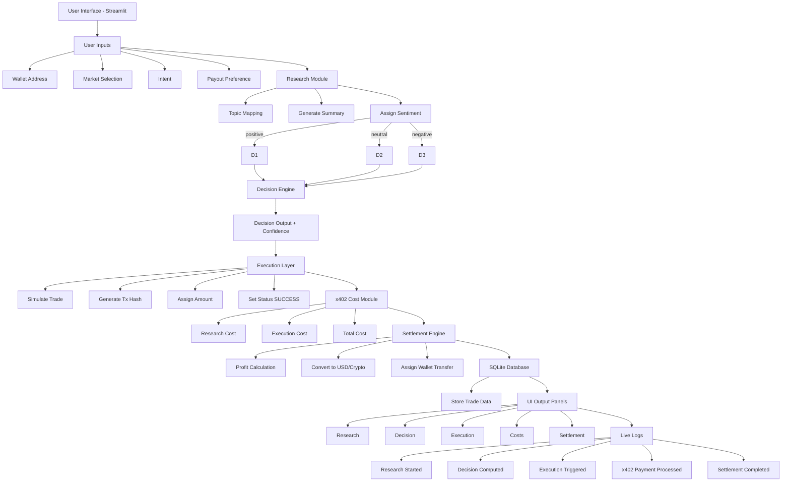
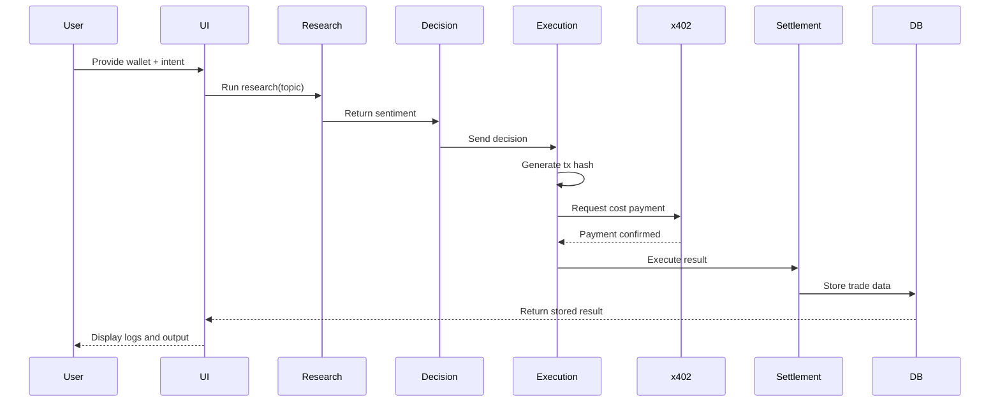

# ElsaFlow

ElsaFlow is an autonomous research-to-execution trading agent designed to demonstrate the execution model of agentic systems aligned with Elsa and x402.

The system is implemented as a single Python script that automatically sets up its environment, installs dependencies, and launches a full Streamlit-based interface. It simulates a complete pipeline from research to execution, including cost handling and settlement.

---

## Overview

ElsaFlow showcases how an autonomous agent can operate end-to-end without manual intervention:

* Accept user intent and wallet input
* Perform structured research
* Derive sentiment and make decisions
* Execute trades in a simulated testnet environment
* Apply x402-style monetization
* Settle results and persist data

The design prioritizes clarity, determinism, and full pipeline visibility.

---

## Workflow


---

## Demo

Loom Video:
https://www.loom.com/share/ad1290f386534856a2a21af546db9c37

---

## Features

### Autonomous Agent Pipeline

* Research → Decision → Execution → Settlement
* Deterministic and reproducible behavior

### Research Module

* Perplexity-style structured output
* Market-based sentiment classification

### Decision Engine

* Positive → YES
* Negative → NO
* Neutral → SKIP
* Confidence scoring

### Execution Layer

* Simulated testnet trades
* Transaction hash generation
* Execution status tracking

### x402 Monetization Simulation

* Research cost tracking
* Execution cost tracking
* Total cost computation

### Settlement Engine

* Profit and loss simulation
* Payout preference handling (USD/Crypto)

### Persistence

* SQLite database
* Full trade history stored locally

### User Interface

* Streamlit-based UI
* Light/Dark theme toggle
* Live execution logs
* Structured output panels

---

## How It Works

1. User inputs wallet address, intent, and market
2. Agent performs structured research and assigns sentiment
3. Decision engine determines trade action
4. Execution layer simulates trade with transaction hash
5. x402 module simulates operational costs
6. Settlement engine calculates outcome
7. Trade is stored in SQLite database
8. UI displays results and logs

---

## System Architecture



---

## Execution Sequence



---

## Project Structure

This project is intentionally implemented as a single-file system:

* Python script handles setup and runtime
* Virtual environment is created automatically
* Dependencies are installed dynamically
* Streamlit app is embedded in the same file

---

## Setup and Run

### Requirements

* Python 3.8+

### Run the application

```bash
python your_script_name.py
```

The script will:

* Create a virtual environment
* Install dependencies
* Launch the Streamlit interface

---

## Access the Application

Open in browser:

http://localhost:8501

---

## Database

* SQLite database file: trades.db
* Automatically created on first run
* Stores all trade executions and metadata

---

## Alignment with Elsa and x402

ElsaFlow demonstrates:

* Intent-based agent design
* Autonomous execution pipeline
* Simulated agent-side cost handling (x402)
* Testnet-style execution abstraction
* Self-custodial user interaction

The system focuses on architecture and execution flow rather than real on-chain integration, ensuring stability and reproducibility.

---

## Notes

* No external APIs required
* Fully deterministic behavior
* Designed for hackathon demonstration
* Optimized for fast setup and execution

---

## License

MIT License
